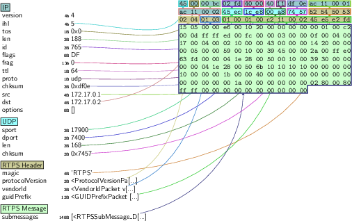

\newpage

## TurtleBot 3 (TB3)

Building on top of the previous [ROS 2 case study](../2_ros2), this piece aims to demonstrate how ROS 2 vulnerabilities can be translated directly into complete robots and how attackers could exploit them.

### Dockerized environment
Like in previous cases, when possible, we'll facilitate a Docker-based environment so that you can try things out yourself! Here's this one:


```bash
# Build
docker build -t hacking_tb3:foxy --build-arg DISTRO=foxy .

# Run headless
docker run -it hacking_tb3:foxy -c "/bin/bash"

# Run headless with byobu config using both Fast-DDS and RTI's Connext
docker run -it hacking_tb3:foxy -c "/usr/bin/byobu -f /opt/configs/pocs_headless_connext.conf attach"

# Run headless sharing host's network
docker run -it --privileged --net=host hacking_tb3:foxy -c "/usr/bin/byobu -f /opt/configs/pocs_headless.conf attach"

# Run headless sharing host's network, and with some nodes launched using OpenDDS
docker run -it --privileged --net=host hacking_tb3:foxy -c "/usr/bin/byobu -f /opt/configs/pocs_headless_opendds.conf attach"


# Run, using X11
xhost + # (careful with this)
docker run -it -v /tmp/.X11-unix:/tmp/.X11-unix -e DISPLAY=$DISPLAY -v $HOME/.Xauthority:/home/xilinx/.Xauthority hacking_tb3:foxy -c "/usr/bin/byobu -f /opt/configs/pocs_connext.conf attach"

```

### Searching for TB3s around (reconnaissance)

```bash
python3 exploits/footprint.py 2> /dev/null
```

It'll find the CycloneDDS node `teleop_keyboard`, which respond to the crafted package and identify the corresponding endpoint.


### Messing up with TB3's traffic


```bash
python3 exploits/reflection.py 2> /dev/null
```


### Crashing TB3s running "best in the world" DDS: RTI Connext




Real Time Innovations (RTI) is one of the leading DDS vendors. They claim to have customers across use cases in medical, aerospace, industry and military. They throw periodic webinars about security however beyond these marketing actions, their practices and security-awareness don't seem to live up to the security industry standards. This section will demonstrate how to exploit the already disclosed CVE-2021-38435 in the TurtleBot 3 with RTI Connext, which  [RTI decided not to credit back to the original security researchers](https://community.rti.com/kb/ics-cert-security-notice-ics-vu-575352-vu770071) (us 😜).

Out of the research we reported the following can be extracted:


| CVE ID | Description | Scope    |  CVSS    | Notes  |
|--------|-------------|----------|----------|--------|
| CVE-2021-38435 | RTI Connext DDS Professional, Connext DDS Secure Versions 4.2x to 6.1.0, and Connext DDS Micro Versions  3.0.0 and later do not correctly calculate the size when allocating the buffer, which may result in a buffer  overflow | ConnextDDS, ROS 2<sub>*</sub>   | [8.6](https://www.first.org/cvss/calculator/3.0#CVSS:3.0/AV:N/AC:L/PR:N/UI:N/S:U/C:L/I:L/A:H/E:P/RL:O/RC:C/CR:M/AR:H) | Segmentation fault via network   [>= 6.1.0](https://community.rti.com/kb/ics-cert-security-notice-ics-vu-575352-vu770071) |


The security flaw in this case affects solely RTI Connext DDS and is a segmentation fault caused by a [malformed RTPS packet](exploits/crash_connext.py) which can be triggered remotely over the network.

In a nutshell, Connext serializer in RTI Connext throws an error while digesting this package, which leads the corresponding ROS 2 Node to exit immediately, causing denial of service. In addition, depending on the Node's computations, it may also lead to safety issues due to the fact that the communication is interrupted immediately. The flaw affects both publishers and subscribers, and an attacker could selectively *crash* specific Nodes which may compromise the robot computational graph for achieving *beyond-DoS* malicious objectives.


The interest of this flaw is that <ins>it somewhat shows how easy it is to compromise a computational graph built with the *best in the world* DDS solution😓 </ins> (see screenshot from RTI Connext's site below, their words):


The following clip depicts how the flaw is exploited in a simulated TurtleBot 3 robot. Note how the teleoperation Node is first launched and stopped, demonstrating how the corresponding topics' velocity values are set to zero after the Node finishes. This avoids the robot to move in an undesired manner. If *instead of stopping the teleoperation Node manually, we crash it using CVE-2021-38435*, we can observe how the last velocities are kept infinitely, leading to robot  to crash into the wall.


### Crashing a simple ROS 2 Node with RTI's Connext DDS
Here's a simpler PoC that launches a ROS 2 publisher which is then crashed by also exploiting CVE-2021-38435:

[](https://asciinema.org/a/451837)

```bash
# split 1
docker run -it hacking_tb3:foxy -c "/bin/bash"
RMW_IMPLEMENTATION=rmw_connext_cpp ros2 run demo_nodes_cpp talker

# split 2
sudo python3 exploits/crash_connext.py 2> /dev/null
```
